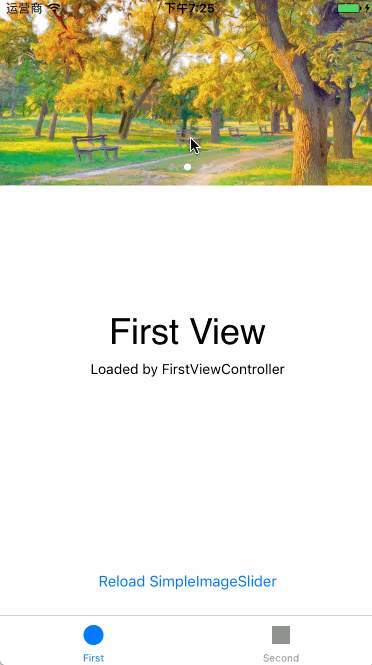

# SimpleImageSlider

[![Swift Version][swift-image]][swift-url]
[](https://github.com/Carthage/Carthage)
[](http://opensource.org/licenses/MIT)

A simple and lightweight 'Image Slide View' for iOS written by Swift with UICollectionView and UIPageControl(No dependencies). You can use it easily with the complete demo. 
[中文说明文档](http://www.jianshu.com/p/a6cfb8367d09)



---

## Requirements

- iOS 8.0 +
- Xcode 8.0 +

## Installation

### Carthage (Recommend)
[中文简易教程`Github](https://github.com/pangpingfei/SwiftBlog/blob/master/Others/Carthage.md) | [中文简易教程`Jianshu](http://www.jianshu.com/p/ab2768af4d94) 

Create a `Cartfile` that lists the framework and run `carthage update`. Follow the [instructions](https://github.com/Carthage/Carthage#if-youre-building-for-ios) to add `$(SRCROOT)/Carthage/Build/iOS/SimpleImageSlider.framework` to an iOS project.

```
github "pangpingfei/SimpleImageSlider"
```

Run `carthage update --platform iOS` to build the framework and drag the built `SimpleImageSlider.framework` into your Xcode project.

To get the full benefits import `SimpleImageSlider`

``` swift
import SimpleImageSlider
```

### Manually
1. Download and drop ```SimpleImageSlider.swift``` into your project.  
2. Congratulations!  

## Usage

### Implement 'SimpleImageSliderData'

```swift
// your own class or struct
struct MyData {
	var id: String?
	var image: UIImage?
	var imageUrl: String?
}

```

```swift
extension MyData: SimpleImageSliderData {
	public func setImage(for imageView: UIImageView) {
		imageView.image = self.image
		// in this func you can also load a network image
	}
}
```

### Init SimpleImageSlider

```swift
// init a slider
let frame = CGRect(x: 0, y: 0, width: UIScreen.main.bounds.width, height: UIScreen.main.bounds.width/2)
slider = SimpleImageSlider(frame: frame, dateSource: self, delegate: self)
		
// setup slider's pageControl if necessary
slider.currentPageIndicatorColor = nil //.black
slider.pageIndicatorColor = nil //.gray
slider.hidePageControlForSinglePage = true

// 		slider = SimpleImageSlider(frame: frame)		
// setup slider's delegate and dateSource, if you use init(frame) func.
//		slider.delegate = self
//		slider.dataSource = self
		
// add to your view
self.view.addSubview(slider)

// if you want to stop or start sliding automatic, set isEnableAutoSlide.
slider.isEnableAutoSlide = false

```


### Implement 'SimpleImageSliderDataSource'

```swift
func simpleImageSlider(_ imageSlider: SimpleImageSlider) -> [SimpleImageSliderData] {
	return data
}

```

```swift
fileprivate var data = [MyData]()

// prepare for dataSource
for i in 1...3 {
	if let image = UIImage(named: "\(i)") {
		data.append(MyData(id: "\(i)", image: image, imageUrl: nil))
	} else {
		break
	}
}

```


### Implement 'SimpleImageSliderDelegate'

```swift
func simpleImageSlider(_ imageSlider: SimpleImageSlider, didTouchImageAt imageSliderData: SimpleImageSliderData) {
	// do what your want to do
	let msg = "simpleImageSlider didTouchImageAt \((imageSliderData as! MyData).id!)"
	print(msg)
}

```

### Attention!!!

```swift
// if your datasource updated, call this function
slider.reloadData()
```

```swift
// if you want to deinit, set isEnableAutoSlide to false
// also, if your view is invisible, you should set false, and set true when view is visible
// such as, 'viewDidAppear': slider.isEnableAutoSlide = true, 'viewWillDisappear': slider.isEnableAutoSlide = false
slider.isEnableAutoSlide = false
```

### More...

> For more information please see the demo in project.

## License
SimpleImageSlider is available under the MIT license. See the [LICENSE file](https://github.com/pangpingfei/SimpleImageSlider/blob/master/LICENSE).

[swift-image]:https://img.shields.io/badge/swift-3.0-orange.svg
[swift-url]: https://swift.org/
